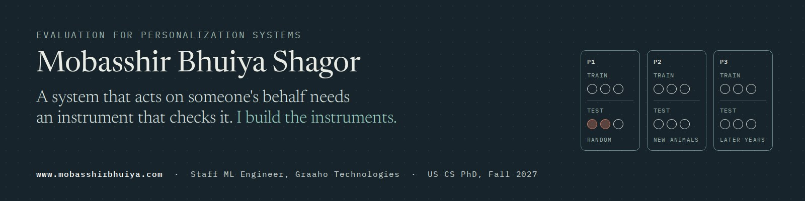

### Hi, I'm Mobasshir

I build instruments that test whether a learned system still deserves trust once it meets real people: longitudinal benchmarks, evaluation protocols that separate identity leakage from genuine distribution shift, and audits of whether a recommender's explanation matches what it actually did.

It started with a cow. In 2019 I built a model that estimates a cow's weight and breed from photographs, and it was a runner-up at Bangladesh's national ICT awards. What nobody asked was whether it would still work a year later, on animals it had never seen. I spent the next six years collecting the data to find out.

By day I'm a Staff ML Engineer at [Graaho Technologies](https://www.graaho.com/) in Dhaka, where I lead the machine learning and backend team. I'm applying to US PhD programmes in computer science for Fall 2027, and I'm open to applied scientist roles.

**Research**

- **BoviShift** (first author, project lead): a six-year benchmark of 2,657 animals that splits an accuracy drop into identity leakage and temporal shift. Code and data will be released publicly.
- **Auditing LLM-based recommenders** (in preparation): does the stated explanation match the ranking, does the model invent item attributes, and do those failures fall unevenly across users? Runs without GPU compute.
- **[CID](https://github.com/bhuiyanmobasshir94/CID)** (ICCA 2022): 513 cattle across 8 breeds, 2,052 photographs and 15,812 video frames, released with regression and classification baselines. [Paper](https://doi.org/10.1145/3542954.3543018)

**In production, one rule each**

| System | The rule it enforces |
|---|---|
| [AlgoRec](https://aws.amazon.com/marketplace/pp/prodview-wux7ieb5jmhhy), a recommendation platform on AWS Marketplace | No model goes live until it beats a popularity baseline on AUC |
| [Koronik](https://koronik.ai/), customer-service agents for Islami Bank Bangladesh, 5,000+ people a day | Below a confidence threshold, the agent stops and hands the customer to a person |
| [Margin](https://www.margin.mobasshirbhuiya.com/), an adaptive writing tutor I built for myself | An LLM grades; deterministic code decides which scores the learner may see |
| [Easymator](https://easymator.com/login), construction takeoff from drawings | Wall detection stays manual, because its mistakes would be invisible to the contractor |

Each rule is a small evaluation instrument inside a product. My research asks how to make them general. Margin's [source](https://github.com/bhuiyanmobasshir94/margin) is private; access on request.

**Open source worth a look**

- [claude-standing-orders](https://github.com/bhuiyanmobasshir94/claude-standing-orders): an orchestration template for agentic coding in which authorization boundaries fail closed.
- [traffic-ai](https://github.com/bhuiyanmobasshir94/traffic-ai): vehicle analysis and toll collection from live video ([demo](https://traffic-ai.streamlit.app/)).
- [Cow-weight-and-Breed-Prediction](https://github.com/bhuiyanmobasshir94/Cow-weight-and-Breed-Prediction): the code behind CID and the original Smart Guess models.
- [Categorized-Affect-Map](https://github.com/bhuiyanmobasshir94/Categorized-Affect-Map): my undergraduate thesis, published at ICCA 2020.

**Also**

I translated Week 12 of the [NYU Deep Learning course](https://atcold.github.io/NYU-DLSP20/bn/week12/12/) (Yann LeCun and Alfredo Canziani) into Bengali. AWS Certified Machine Learning, Specialty. Kaggle 3× Expert.

Most of my day-to-day work is in PyTorch, FastAPI, MLflow, Airflow and AWS (SageMaker, Bedrock).

**Find me:** [mobasshirbhuiya.com](https://www.mobasshirbhuiya.com) · [Google Scholar](https://scholar.google.com/citations?user=QS61JrYAAAAJ) · [ORCID](https://orcid.org/0000-0003-3912-7650) · [Semantic Scholar](https://www.semanticscholar.org/author/Mobasshir-Bhuiya-Shagor/1575439165) · [DBLP](https://dblp.org/pid/272/7701) · [LinkedIn](https://www.linkedin.com/in/mobasshir-bhuiya-shagor/) · [Kaggle](https://www.kaggle.com/mobasshir) · [mobasshir.bhuiya@gmail.com](mailto:mobasshir.bhuiya@gmail.com)
